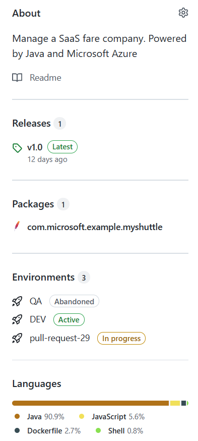

# Introduction

MyShuttle is a sample Java/JEE application that provides booking system, admin portal and a control system for the drivers. The application uses entirely open source software including Linux, Java, Apache, and MySQL which creates a web front end, an order service, and an integration service.

## Sample

> For historical reasons the default branch for the repository is `demos/main`.

> This is a sample application that is not intended to show any programming best practices. In fact it uses old dependencies on purpose to show dependabot (like log4j), there is a branch with a hardcoded PAT to show credential scanning and the workflows have some bad practices on purpose (can you spot them?).

The intent of this repo is to show some capabilities:

- [Environments](https://docs.github.com/en/actions/deployment/environments):
  - [Approvals](https://docs.github.com/en/actions/managing-workflow-runs/reviewing-deployments)
  - [Protection rules](https://docs.github.com/en/actions/deployment/environments#environment-protection-rules)
- [Pull Requests](https://docs.github.com/en/github/collaborating-with-pull-requests/proposing-changes-to-your-work-with-pull-requests/about-pull-requests) and [protected branches](https://docs.github.com/en/repositories/configuring-branches-and-merges-in-your-repository/defining-the-mergeability-of-pull-requests/about-protected-branches#require-status-checks-before-merging) - When a pull request is created, it:
  - Builds code and runs unit tests using Maven (including code coverage).
  - Provisions an isolated ephemeral environment (which is destroyed when the pull request is closed/completed)
  - Runs integrations tests on the provisioned environment using [Playwright](https://playwright.dev/)
  - Tests (both unit and function tests) results are published as PR comments (and PR checks) as well as code coverage reports.
- [Composite Actions](https://docs.github.com/en/actions/creating-actions/creating-a-composite-action) - Uses composite actions as a way to have a template and to reduce repetitive steps. The composite action provisions, deploys and runs integration tests. The composite actions are stored in the [actions](actions) folder. The implementation of this action is certainly debeatable since it downloads artifacts, which should be a responsibility of the workflow. [Here](https://colinsalmcorner.com/github-composite-actions) is a nice writeup of the pros and cons of using composite actions.
- Packages - When a [release](https://docs.github.com/en/repositories/releasing-projects-on-github/about-releases) is created a maven package is published to [GitHub packages](https://github.com/features/packages)
- [GitHub Advanced Security](https://docs.github.com/en/get-started/learning-about-github/about-github-advanced-security) - CI/CD performs code scanning analysis and credential scanning is also enabled:
  - Code is scanned with [CodeQL](https://codeql.github.com/docs/)
  - Container image are scanned with both [trivy](https://www.aquasec.com/products/trivy/) and [Anchore](https://anchore.com/)
  - We perform a DAST analysis on deployed code using [OWASP Zap](https://www.zaproxy.org/docs/docker/baseline-scan/)
  - Newly added or updated dependencies are checked with [Dependency Review Action](https://github.com/actions/dependency-review-action) for:
    - Potential vulnerabilities
    - Unwanted licenses
- Dependabot - To ensure supply chain security with [dependabot security updates](https://docs.github.com/en/code-security/dependabot/dependabot-security-updates/about-dependabot-security-updates) and [dependabot version updates](https://github.blog/2020-06-01-keep-all-your-packages-up-to-date-with-dependabot/)
- [code owners](https://docs.github.com/en/repositories/managing-your-repositorys-settings-and-features/customizing-your-repository/about-code-owners) - Automatically assign pull request code reviewers  based on the file path(s) of the proposed changes.
- [Issue templates](https://docs.github.com/en/communities/using-templates-to-encourage-useful-issues-and-pull-requests/configuring-issue-templates-for-your-repository)
- [Job Summaries](https://github.blog/changelog/2022-05-09-github-actions-enhance-your-actions-with-job-summaries/)
- Generates an SBOM with (Anchore sbom action)[hhtps://github.com/anchore/sbom-action] mostly to show [runtime found dependencies](https://github.blog/changelog/2022-06-17-dependency-graph-has-a-rest-api-for-submitting-dependencies-detected-at-build-time/)
- Runs [OSSF scorecard](https://github.com/ossf/scorecard#what-is-scorecards) [action](https://github.com/ossf/scorecard-action) to ensure (this repo intentionally does a bad job at it) it follows best practices (has code scanning,tests,workflows use minimum permissions,etc). You can check the results in code scanning results

Uses [ARM templates](), to provision the `DEV` and `QA` environments using Infrastructure as code (IaC) and GitHub Actions. The arm templates create both a WebApp and a MySql server (per environment, each environment is a separate resource group). ARM templates are checked with both [Azure Resource Manager Toolkit](https://docs.microsoft.com/en-us/azure/azure-resource-manager/templates/test-toolkit) and [checkov](https://github.com/bridgecrewio/checkov). (can you spot the issues being flagged?)

## Screnshots

CI/CD Workflow

Releases, Packages and environment in repo view

## Trying this out

I have created some [instructions](./docs/configuring.md) if you want to run this sample  on your own repo.

> Although you can fork the repository, if you want to try the enterprise features I recommend that you do a clone and push to your organization (or the simpler [import](https://docs.github.com/en/github/importing-your-projects-to-github/importing-source-code-to-github/importing-a-repository-with-github-importer)). While you can fork a repository into an organization you can **only** have a fork per target organization, so it is recommended to clone the repository into your organization in order to allow more people on _your_ organization to try it out.

> **NOTE** If you import the repository you will need to change the default branch to `demos/main`. see [Changing the default branch](https://docs.github.com/en/repositories/configuring-branches-and-merges-in-your-repository/managing-branches-in-your-repository/changing-the-default-branch)

It requires GitHub Enterprise to use [environments](https://docs.github.com/en/actions/deployment/environments) and manual approvals. On a personal repo you won't see environments and approvals but everyhing else works without making changes.

The deletion of the ephemeral environment when the Pull request is closed requires you to create an app (or use a PAT token and changing the [pr-closed](.github/workflows/pr-closed.yml) workflow to use it instead of the app)
