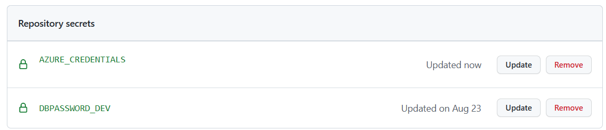
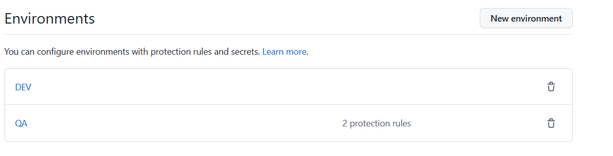
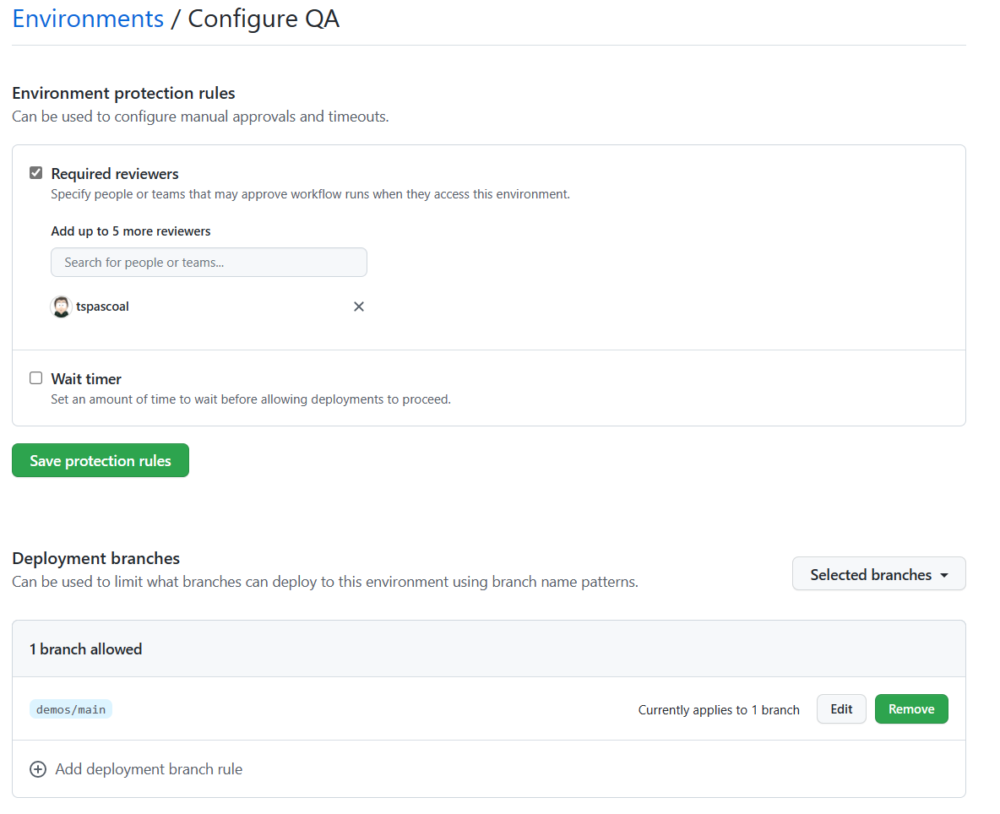

# Configuring your repository

In order to run the workflows you need to configure these things before hand.

## Secrets

You need to configure a few secrets in your repository:

- AZURE_CREDENTIALS - See [Azure](#Azure) section below
- DBPASSWORD_DEV - the password for the mysql database (create a random secure password). This is used for both the `DEV` and `QA` environments.



### Azure

In order to deploy the applicaton to Azure, you will need to have an Azure subscription, create a service principal (at least contributor permission on the resource group you are deploying to) and store it on a secret called `AZURE_CREDENTIALS`

To create a service principal, you can follow the instructions on [the azure/login action](https://github.com/Azure/login#configure-deployment-credentials) [recommended :)]

If you don't like following instructions this is the command you need to run

(you may want to replace the `MyShuttleDemo` with something more meaningful to you).

```bash
az ad sp create-for-rbac --name "MyShuttleDemo" --sdk-auth --role contributor
```

It is also advisable you scope the service principal to a resource group (using the `scopes` parameter or on azure portal).

Now add the service principal to your repo secret with the name `AZURE_CREDENTIALS` (see [Creating encrypted secrets for a repository](https://docs.github.com/en/actions/security-guides/encrypted-secrets#creating-encrypted-secrets-for-a-repository) for more information))).

If you want to automate this step and have [GitHub CLI](https://cli.github.com/) installed, you can use the following command: (you will need to replace the name of the repository with your own (hint: after `-R`))

```bash
az ad sp create-for-rbac --name "MyShuttleDemo" --sdk-auth --role contributor | gh secret set AZURE_CREDENTIALS -R  tspascoal-demo2/MyShuttle
```

## Environments

[Environment](https://docs.github.com/en/actions/deployment/environments) capabilities is only available in GitHub Enterprise, if you are running this on a personal GitHub account, you can skip this section. (the workflows will still run, but they will not have access to the environment capabilities)

You will need to create two environments:

- dev
- qa



In the `QA` environment you might want to create two protection rules:

- Required reviewers - To ensure code is only deployed to `QA` environment after one or more reviewers have approved it. See how to configure at [Reviewing deployments](https://docs.github.com/en/actions/managing-workflow-runs/reviewing-deployments)
- Deployment branches - To ensure that only code built from the default branch is deployed to `QA`



## Challenge

In order to delete the ephemeral environment created when a Pull Request is created, you can't use the built-in [GITHUB_TOKEN](https://docs.github.com/en/actions/security-guides/automatic-token-authentication) to do so you the [pr-closed workflow](../.github/workflows/pr-closed.yml) uses a GitHub Application to get a temporary token with enough permissions to delete the environment.

The challenge is to create a GitHub Application with permissions to delete the environment.

You will also need to create two secrets:

- PERMISSIONS_APP_ID
- PERMISSIONS_APP_PRIVATE_KEY

> As an alternative you can also remove the requirement to use an application to delete the environment and use a [Personal Access Token](https://docs.github.com/en/authentication/keeping-your-account-and-data-secure/creating-a-personal-access-token?source=post_page---------------------------) instead.